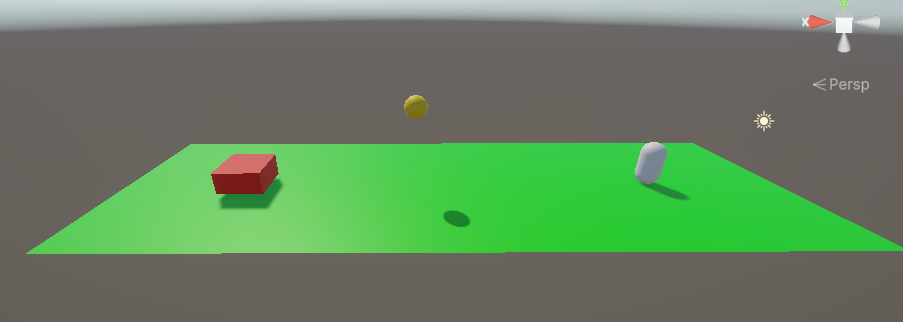

# Documentatie Jumper Oefening.

# Standaard testopstelling

# Recreatie van de oefening
Aangezien alles waarmee wij werken op Github zelf staat lijkt mij een tutorial over het recreëren onnodig aangezien het al geregreërd is.
Er kan wel wat gezegd worden over de commands die worden uitgevoerd om de testing eenmaal te doen starten.

1. Open Anaconda Prompt
2. Navigeer naar het project onder de /project/mltraining repository
3. activeer uw conda environment als deze nog niet actief is.
4. Enter het commando: "mlagents-learn config/CubeAgent.yaml --run-id=' ' 'deze naam mag je kiezen' ' ' ".
5. Druk op "Play" in de Unity editor!

# Verloop van de training
Origineel hadden we het gedacht dat we met discrete actions wouden werken omdat springen geen extra acties nodig heeft voor de AI, anders sprint hij misschien maar net over het obstakel en dat kan voor minder gewenste uitkomsten zorgen.

### Probleem 1: AI Sprint niet.
Descriptie: Bij de eerste testen van de AI hadden we het de mogelijkheid gegeven om te springen maar dat deed de AI niet. Ook in de heuristic tests ging dit gewoon perfect. Blijkt dat onder de optie "Branch 0 Size" de hoeveelheid opties op 2 moet staan. (eentje voor optie 0 en optie 1). Dit stond origineel op 1 waardoor de AI geen mogelijke button inputs had gekregen om uit te testen.

### Probleem 2: Degenerative behaviour 
Descriptie: Na het fixen van het eerste probleem liepen we tegen de moeilijkheid aan dat de AI zich niet veel gaf om de minpunten. Aangezien de AI kan springen en hier soms een punt mee haalt zal deze permanent blijven springen. Om dit op te lossen hadden we de optie toegevoegd dat bij een "onproductieve sprong" de AI een minpunt kreeg aangezien deze actie nutteloos is.
Jammergenoeg blijft de AI deze negatieve punten negeren en krijgt zo alleen maar negatieve medians op zijn scores..

## Behavior Parameters
Acties: 1 Discrete actie, Branch 0 size: 2 voor de AI de mogelijkheid wel of niet te springen.
Benchmark medium reward: -2.5
